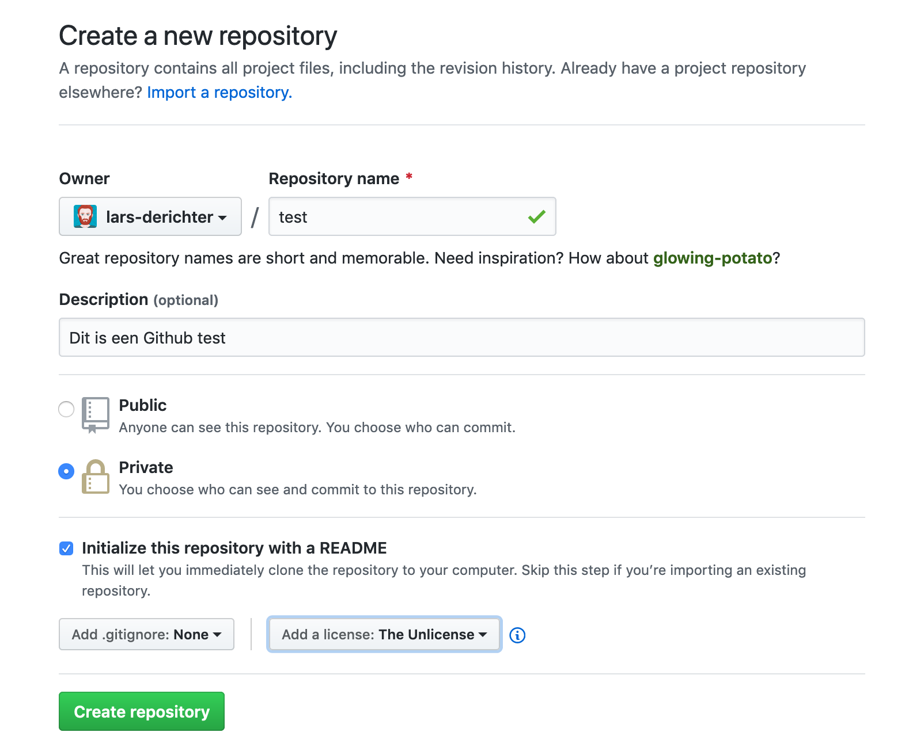
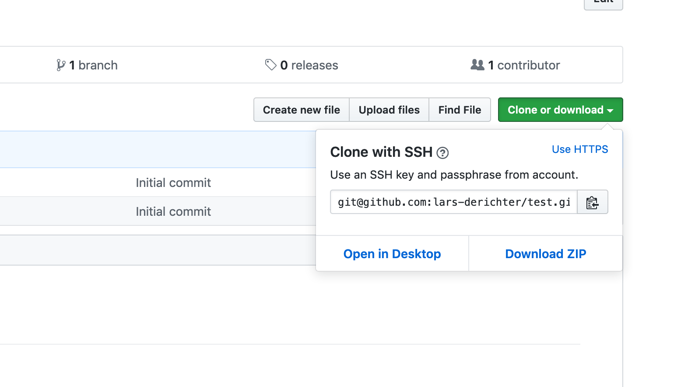
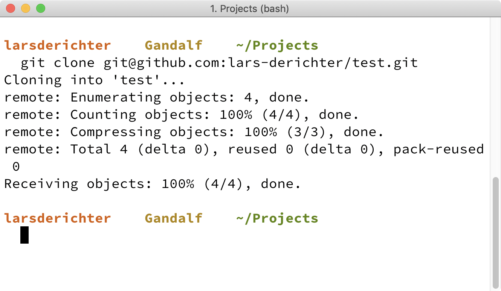

# Version Control

## Slides

We overlopen samen de slides: [01.03 Version control – slides](/slides/01.03.version-control ":ignore").

## Workflow voor individuele projecten

Voor als je alleen aan iets werkt, maar je wel de voordelen van Git (en Github) wil.

### Setup

1. Maak een nieuwe repository op Github. Voorzie een description. Kies zelf of je er een Public of Private repository van wil maken. Duid **Initialize this repository with a README** aan. Voeg optioneel een licentie toe.



2. Clone de repository naar je lokale machine. In Git Bash of Terminal ga je naar de hoofddirectory voor je projecten en dan typ je:

```
git clone <repository URL>
```

Nu heb je een directory met de naam van je repository die een lokale versie van de repository bevat met alle bestanden en hun volledige commit-geschiedenis.





### Werk

1. Doe programmeerwerk in je editor (VS Code).
2. `git status` om te controleren welke bestanden je gewijzigd hebt
3. `git add <bestanden>` om de gewijzigde bestanden klaar te zetten om te comitten (in de staging area of index)
4. `git commit -m "<goed logbericht>"` om de wijzigingen toe te voegen aan je Git-geschiedenis
5. `git push` om je aangepaste Git-geschiedenis door te sturen naar Github (zodat je een veilige backup hebt en/of je project met zijn geschiedenis kan delen)

Deze stappen herhaal je zo lang je aan je project werkt.

## Workflow voor opdrachten

De workflow om aan de opdrachten bij deze (en andere) cursussen te werken en ze correct in te dienen via Github.

### Setup

1. Je krijgt een Github Classroom link van ons die je ingeeft in je browser. Volg de instructies die op je scherm komen. Als iets onduidelijk is, vraag dan onmiddellijk hulp.
2. `git clone <repository-URL>` om de hele repository te klonen naar je eigen machine
3. `git remote add opdracht <originele repository-URL>` om je lokale repository ook te linken aan de originele opdrachten, voor het geval wij tijdens het schooljaar nog updates zouden doen. Je krijgt van ons de originele URL. Voor deze curus is dat `git@github.com:7-WN/webontwikkeling-cursus.git`

### Werken aan je opdrachten

1. Doe programmeerwerk in je editor (VS Code).
2. `git status` om te controleren welke bestanden je gewijzigd hebt
3. `git add <bestanden>` om de gewijzigde bestanden klaar te zetten om te comitten (in de staging area of index)
4. `git commit -m "<goed logbericht>"` om de wijzigingen toe te voegen aan je Git-geschiedenis
5. `git push` om je aangepaste Git-geschiedenis door te sturen naar Github (zodat je een veilige backup hebt en/of je project met zijn geschiedenis kan delen)

Deze stappen herhaal je zo lang je aan een opdracht werkt.

### (Deel)opdracht indienen

Bij elke opdracht zit een README.md bestand met de uitleg. Daarin staat steeds ook een tag die je kan gebruiken om jouw definitieve versie voor een opdracht te markeren.

1. `git tag -a <opdracht-tag> -m "<kort bericht>"` om je recentste commit te taggen met de opdracht-tag; voeg steeds een kort berichtje toe
2. `git push --tags` om je tags door te sturen naar Github, zodat wij ze kunnen zien

### Opdrachten synchroniseren met onze recentste versie

In de loop van het schooljaar doen wij soms nog aanpassingen aan de cursus. We zullen je soms vragen om die te importeren in je eigen repository. Dat doe je zo:

1. `git pull --rebase opdracht master` om onze updates binnen te halen en jouw werk erop toe te passen
2. `git pull --rebase` om de aanpassingen die je al gedaan had in je eigen Github repository toe te passen
3. `git push` om je aangepaste geschiedenis (met onze recentste aanpassingen) naar jouw eigen Github repository door te sturen

!> Maak nu opdracht [01.01 Git gebruiken](/opdrachten/01.de-ontwikkelomgeving/01.git-gebruiken/)

## Workflow voor groepsprojecten

Dit is nog niet aan de orde, maar als we ooit met groepsprojecten werken, kan je voor je begint dit best even bekijken.

TODO:

## Herhalen, oefenen, tutorials

- [What is Git? The 5 Minute Tutorial](https://medium.com/@alanscarpa/what-is-git-the-5-minute-tutorial-daa0df0cc98c): heel goed om mee te beginnen
- [Git - the simple guide](http://rogerdudler.github.io/git-guide/): zeer handige gids met de belangrijkste commando’s
- [Learn git concepts, not commands](https://dev.to/unseenwizzard/learn-git-concepts-not-commands-4gjc): met deze tutorial leer je de verschillende concepten goed begrijpen, voor je de juiste commando’s leert.
- [Git Basics](https://git-scm.com/videos): video tutorials voor wie alles liever een keer hoort en ziet
- [Git for Designers](https://medium.com/@dfosco/git-for-designers-856c434716e): artikel voor wie het nog niet helemaal snapt en het nog eens op een andere manier wil uitgelegd krijgen
- [Visualizing Git Concepts with D3](https://onlywei.github.io/explain-git-with-d3/): voor de beelddenkers onder ons
- [Basic Git Workflow | codecademy](https://www.codecademy.com/learn/learn-git/modules/learn-git-git-workflow-u): interactieve cursus van codecademy

## Referentiemateriaal

- [Oh shit, git!](https://ohshitgit.com): voor wanneer je het verkl\*\*t hebt
- [Visual Git Cheatsheet](http://ndpsoftware.com/git-cheatsheet.html): mooi, visueel overzicht van commando’s
- [How to Write a Git Commit Message](https://chris.beams.io/posts/git-commit/): hoe schrijf je goede commit-boodschappen voor ons, voor je klasgenoten, of voor je toekomstige zelf
- [Git documentation](https://git-scm.com/docs): de officiële ‘handleiding’ voor Git
- [Think Like (a) GitA ](http://think-like-a-git.net): soms begrijp je iets beter door wel alle details te kennen
- [Pro Git](https://git-scm.com/book/en/v2): gratis boek voor als je een echte Git Professional wil worden (ook beschikbaar [in het Nederlands](https://git-scm.com/book/nl/v2))
