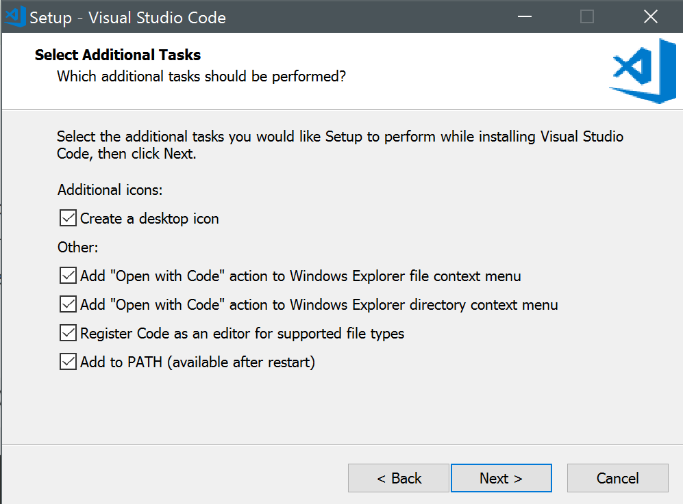
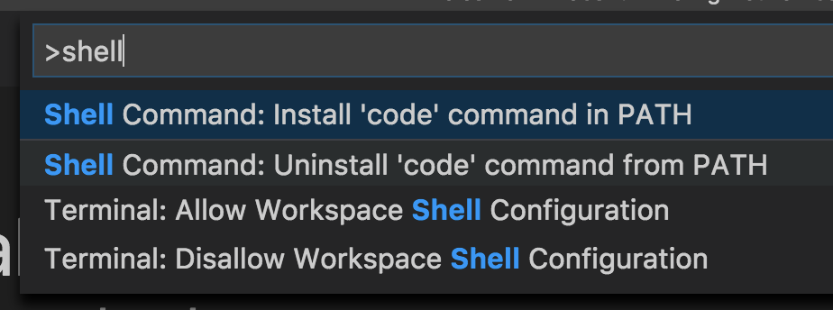

# Text Editor

## IDE vs. Text Editor

IDE staat voor Integrated Development Environment. Het is een geïntegreerde ontwikkelomgeving om te programmeren (software te ontwikkelen) in een bepaalde programmeertaal (bijv. Java of C#) of op een bepaald platform (bijv. .Net).

Het bevat alles wat je nodig hebt om programmeercode te schrijven, te testen, om aan foutopsporing te doen (debugging) etc. IDE’s hebben meestal ook wel een aantal nadelen: het zijn vaak grote, zware programma’s die veel systeembronnen gebruiken, je kan ze moeilijk aanpassen aan je persoonlijke voorkeuren of stijl en ze zijn meestal toegespitst op slechts één programmeertaal of platform. Daarnaast zijn het vaak erg dure programma’s met ingewikkelde licentievoorwaarden. Bekende voorbeelden zijn Microsoft Visual Studio en Eclipse.

Een text editor is in oorsprong een programma dat geschikt is om tekstbestanden te bewerken. (Niet te verwarren met een tekstverwerker zoals Microsoft Word waarmee je documenten kan bewerken die grotendeels uit tekst bestaan, maar die ook opmaak en eventuele afbeeldingen bevatten. Een Word-document is GEEN tekstbestand.)

Alle broncode voor software en ook voor websites bestaat uit tekstbestanden en in principe kan je met eender welke text editor een website bewerken, zelfs met Kladblok (Notepad of TextEdit voor de maccers).

In de loop der tijden zijn er wel meer gespecialiseerde text editors ontstaan om programmeercode mee te schrijven. De meeste goede programming text editors bevinden zich qua mogelijkheden ergens tussen de meest eenvoudige text editors à la Kladblok en een uitgebreide IDE als Visual Studio. (Als student kan je ze vaak wel gratis gebruiken, maar dan mag je de software die je ermee ontwikkelt meestal niet op de markt brengen. De leerlingen van onze school kunnen gratis gebruik maken van _MS Visual Studio_ (vraag aan Mr. Kuppens) en ook van van [de gespecialiseerde IDE’s van Jetbrains](https://www.jetbrains.com/).)

Belangrijke voordelen zijn dat het lichtere paketten zijn die je computer minder belasten, dat je ze (met behulp van plugins en extensies) helemaal naar je hand kan zetten, dat ze meestal bruikbaar zijn voor heel veel verschillende programmeertalen en tot slot dat ze vaak gratis en/of open source zijn.

Bekende text editors zijn o.a. Atom, Brackets en VS Code. Dit schooljaar zullen we vooral werken met VS Code.

[Meer weten](https://spin.atomicobject.com/2015/12/22/ide-vs-text-editor/)

---

## Visual Studio Code installeren

_VS Code_ of voluit _Visual Studio Code_ is de programming text editor van Microsoft (niet te verwarren met Microsofts IDE, _Visual Studio_). Hij is volledig open source en je kan hem gratis downloaden en installeren. Bovendien werkt hij op Windows, Mac en zelfs Linux. Dankzij de vele plugins heeft hij ondersteuning voor zowat alle bestaande programmeertalen en kan je hem helemaal aanpassen aan je eigen wensen. Momenteel is hij de meest gebruikte text editor door webontwikkelaars.

Om hem te installeren zoals wij het graag willen (zodat iedereen met dezelfde instellingen vertrekt en ieders code op de zelfde manier wordt geformateerd) volg je de volgende stappen:

Ga naar https://code.visualstudio.com/ en download de installer voor jouw besturingssysteem.

- Windows-gebruikers: open de installer en selecteer alle opties:
  
- Mac-gebruikers: pak het zip-bestand uit en sleep het icoon naar je Applications-directory. Open daarna het programma, druk de toetscombinatie <kbd>&#8679;</kbd>+<kbd>&#8984;</kbd>+<kbd>P</kbd> in en typ `shell`, selecteer _Shell Command: Install 'code' command in PATH_ en druk op <kbd>&#8629;</kbd>:
  

---

## Belangrijke plugins/extensions voor webontwikkeling installeren

Zoals reeds vermeld, kan je de functionaliteit van je text editor aanpassen en uitbreiden met behulp van plugins en uitbreidingen. Microsoft noemt dit extensions.

De snelste manier om alles juist te installeren is via Powershell (Windows) of Terminal (Mac). Kopieer en plak de lijnen hieronder in de command line omgeving voor jouw systeem.

```
code --install-extension koppt.vscode-view-in-browser
code --install-extension jasonlhy.vscode-browser-sync
code --install-extension esbenp.prettier-vscode
code --install-extension mkaufman.HTMLHint
code --install-extension shinnn.stylelint
code --install-extension dbaeumer.vscode-eslint
code --install-extension formulahendry.auto-rename-tag
code --install-extension christian-kohler.path-intellisense
code --install-extension Zignd.html-css-class-completion
code --install-extension pranaygp.vscode-css-peek
code --install-extension naumovs.color-highlight
code --install-extension wayou.vscode-todo-highlight
code --install-extension vector-of-bool.gitflow
code --install-extension ziyasal.vscode-open-in-github
```

---

## Het uitzicht van Visual Studio Code naar je hand zetten

_‘De gustibus et coloribus non est discutandam’_ (over smaken en kleuren moet niet gediscussieerd worden)

Smaken verschillen, daarom kan je het uitzicht van Visual Studio Code helemaal naar je hand zetten. Dat kan o.a. door middel van themes.

Als je mijn setup wil benaderen, kan je de volgende stappen zetten:

- installeer het [Source Code Pro font](https://www.fontsquirrel.com/fonts/source-code-pro);
- installeer en activeer het [Dracula Theme](https://marketplace.visualstudio.com/items?itemName=dracula-theme.theme-dracula);
- Installeer en activeer het [Material Icon Theme](https://marketplace.visualstudio.com/items?itemName=PKief.material-icon-theme).
