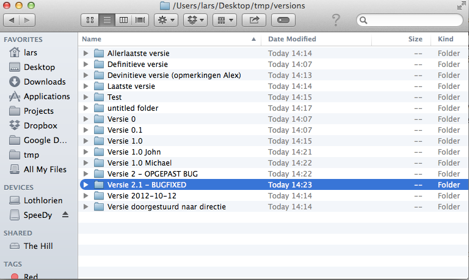
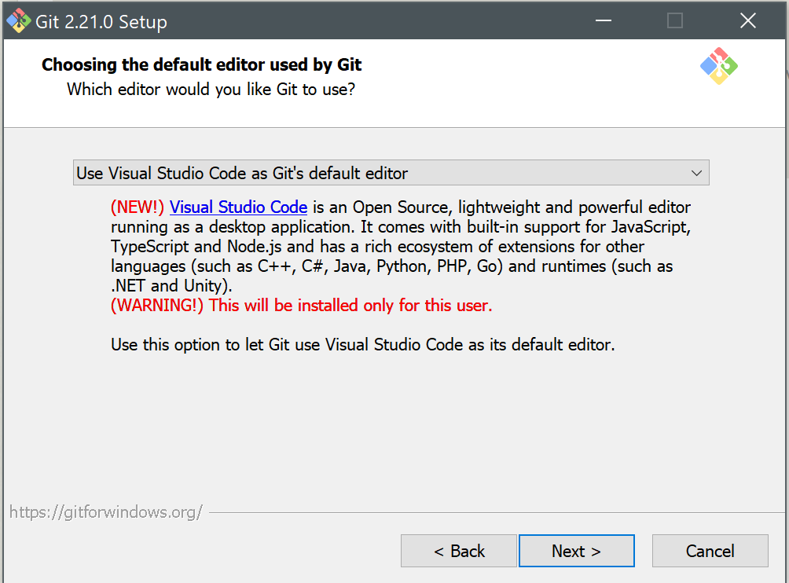
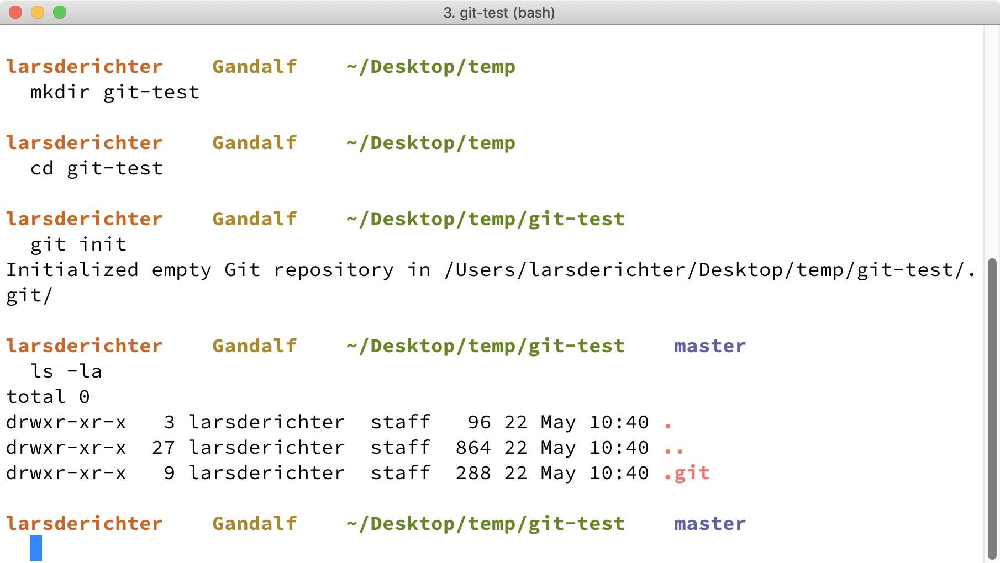
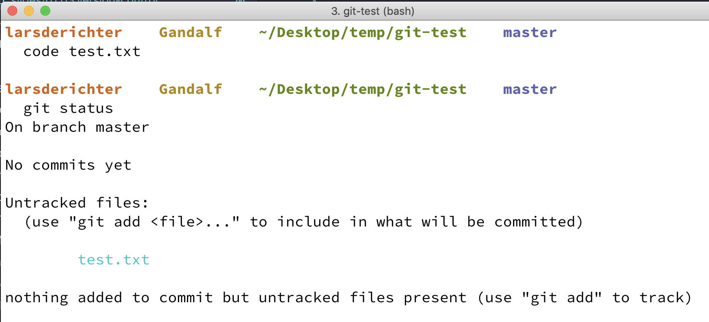
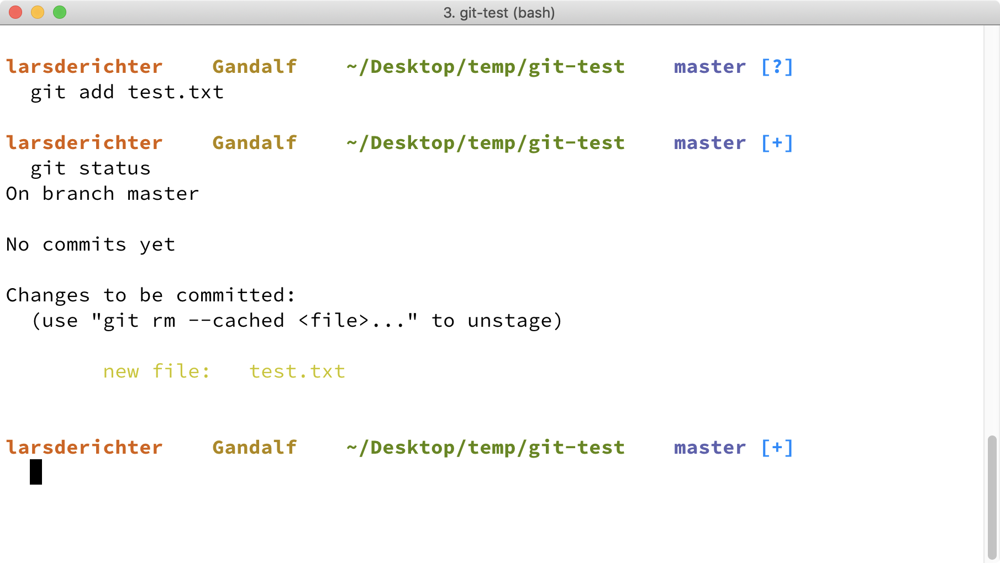
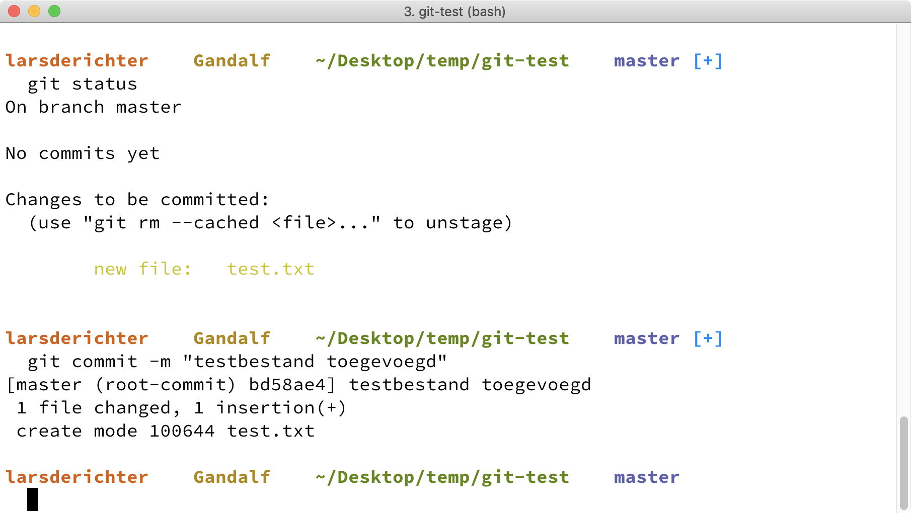
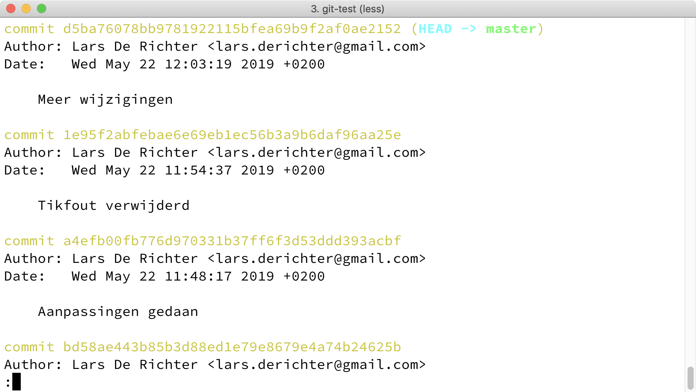
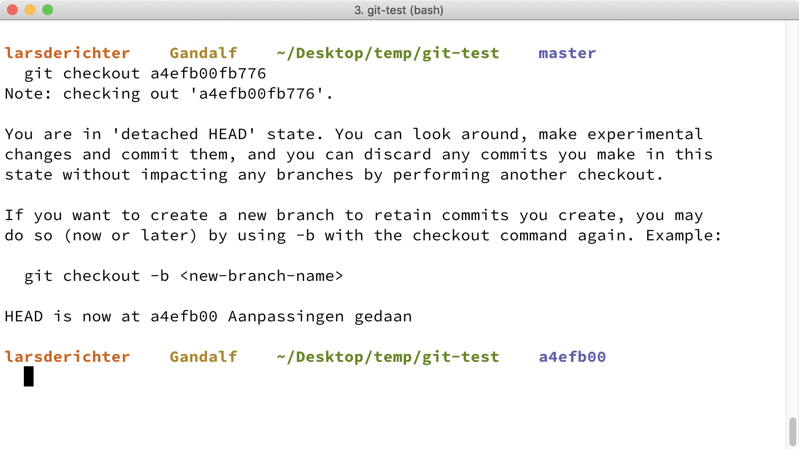

# Version Control

---

# Waarom?

&&&

<!-- .slide: data-background-image="_images/facepalm.gif" data-background-size="contain" -->

## Minder

&&&

<!-- .slide: data-background-image="_images/euphoria.gif" data-background-size="contain" -->

## Meer

&&&

## Nooit meer



&&&

## Wel


&&&

## Ook


&&&

## Dus

- Geschiedenis van alle bestanden <!-- .element: class="fragment" -->
- Rollback/Undo <!-- .element: class="fragment" -->
- Waarom van aanpassingen <!-- .element: class="fragment" -->
- Blame game <!-- .element: class="fragment" -->
- Gelijktijdig werken aan een project <!-- .element: class="fragment" -->

---

# Git

&&&

## Wat?

- distributed <!-- .element: class="fragment" -->
- version <!-- .element: class="fragment" -->
- control <!-- .element: class="fragment" -->

Notes:

- Distributed: used in opposition to Centralized. This means that there is no single "correct" computer for the source code to exist upon. Each person who uses or writes the code will have their own copy of the code and its history.
- Version: This refers to the idea that source code files change over time. When you save a file, that is a single version of the file. When you add a new line of code and save it again, that is a new version of the file.
- Control: The Git system is used to control or manage the process of creating new Versions of source code files, and the process of distributing those versions to other people.

Bron: Ada Developers Academy. (2018, August 13). Intro to Git. Retrieved May 20, 2019, from https://github.com/Ada-Developers-Academy/textbook-curriculum/blob/master/00-programming-fundamentals/git-intro-to-git.md#version-control

&&&

## Linus Torvalds

<!-- .slide: data-background-image="_images/linus-torvalds.jpg" data-background-size="contain" data-background-opacity="0.7"  -->

Ja die van Linux <!-- .element: class="fragment" -->

Notes:

- In 2005 verzuurt de relatie tussen Bitkeeper en de Linux Kernel developers.
- Het meest gebruikte open source version control system (subversion) is niet snel en krachtig genoeg om met een groot project als de Linux kernel te kunnen omgaan
- Linus bouwt dan maar een eigen open source systeem: git.
- Momenteel is dit wereldwijd het meest gebruikte version control system.

---

<!-- .slide: data-background-image="_images/octocat.png" data-background-size="contain" data-background-opacity="0.5" -->

# Github

&&&

## Wat?

- hosting server voor git repositories <!-- .element: class="fragment" -->
- handige interface om je code en geschiedenis te bekijken <!-- .element: class="fragment" -->
- gratis voor open source <!-- .element: class="fragment" -->
- studenten krijgen gratis Pro account <!-- .element: class="fragment" -->
- broncode van de meeste open source projecten <!-- .element: class="fragment" -->
- (eigendom van Microsoft sinds 2018) <!-- .element: class="fragment" -->

&&&

## Maak een Github account aan

Gebruik je e-mailadres van school (belangrijk voor volgende stap)

https://github.com/

&&&

## GitHub Student Developer Pack

Vraag het ‘GitHub Student Developer Pack’ aan:

https://education.github.com/pack

&&&

Mail je github gebruikersnaam naar mij

&&&

## Word lid van 7-WN

Je zal één (of meerdere) e-mail(s) krijgen met een activatielink. Activeer die!

---

# Git installeren

&&&

## Windows gebruikers

&&&

https://git-scm.com/downloads

&&&

Selecteer `Windows Explorer integration`


&&&

Selecteer `Use Visual Studio Code as Git’s default editor`



&&&

Laat verder de defaults staan

&&&

## Mac gebruikers

- op een mac installeer je eerst [Homebrew](https://docs.brew.sh/)
- daarvoor heb je eerst Xcode Command Line Tools nodig
- in Terminal `xcode-select --install` en volg de instructies

&&&

### Homebrew installeren

in Terminal

```
mkdir homebrew && curl -L https://github.com/Homebrew/brew/tarball/master | tar xz --strip 1 -C homebrew
```

&&&

### Git installeren

in Terminal

```
brew install git
```

&&&

## Git configureren

In Git Bash (Windows) of Terminal (Mac) typ je:

1. `git config --global user.name "<jouw naam>"`
2. `git config --global user.email <jouw e-mailadres>`

---

# GUI vs. CLI

&&&

Gebruik command line!

&&&

Tot je begrijpt wat je doet…

&&&

## GUI

- Verbergt complexiteit
- Verbergt details
- Beperkt mogelijkheden
- Bemoeilijkt troubleshooting
- **Je begrijpt niet wat je aan het doen bent**

&&&

## CLI

- Leercurve: commando's leren gaat niet vanzelf
- Geen beperkingen op mogelijkheden
- Instructies zijn éénduidig en compact
- Makkelijker reproduceerbaar

---

# Git in 3 minuten

of 5 of 10…

&&&

## Initialiseer Git repository

Deze stap doe je slechts 1 keer voor een project.

1. open Git Bash (Windows) of Terminal (Mac/Linux)
2. `mkdir git-test` om een nieuwe directory te maken
3. `cd git-test` om in de directory te gaan
4. `git init` om de directory te initialiseren als Git repository

Note:

Met `ls -la` kan je controleren dat er nu een verborgen directory _.git_ is. Daarin zit alles wat Git nodig heeft om je geschiedenis bij te houden etc.

&&&



&&&

## Doe programmeerwerk

1. `code test.txt` om VS Code te openen met een nieuw bestand in de directory
2. Typ iets en sla op vanuit VS Code
3. `git status` laat zien wat er gewijzigd is (op bestandsniveau)

Notes:

`git status` laat zien dat er een nieuw bestand is, maar dat git het nog niet _trackt_, m.a.w. git heeft nog geen geschiedenis van dit bestand.

&&&



&&&

## Zet je werk in de staging area (of index)

- `git add test.txt` (alleen test.txt)
- of `git add *` (alles wat je veranderd hebt in je huidige directory)
- of `git add .` (de huidige directory met alle inhoud)

Notes:

Met `git status` zie je dat het bestand nu bij _Changes to be commited_ staat.

&&&



&&&

## Je werk toevoegen aan je Git geschiedenis

1. `git status` om te controleren wat je gaat committen
2. `git commit -m "Testbestand toegevoegd"` om je wijzigingen (vanuit de staging area) toe te voegen aan je Git geschiedenis; de -m parameter krijgt tussen "" een logbericht

Notes:

- `git status` laat zien dat er niets meer _gecommit_ kan worden _working tree clean_. Dat betekent dat al ons werk veilig opgeslagen zit in de versiegeschiedenis van Git.
- Als je de -m parameter niet gebruikt, opent je standaard editor om je de kans te geven een logbericht te typen. De commit gaat pas door wanneer je dit bestand opslaat.

&&&



&&&

## Synchroniseren met Git server

Als je Git repository gesynchroniseerd zou worden met een Git server (bijv. van Github), zou je je werk en geschiedenis nu synchroniseren/publiceren.

`git push` stuurt je werk naar een Git server

&&&

## Add, Code, Repeat!

Deze stappen herhaal je voortdurend:

1. programmeerwerk
2. `git status`
3. `git add <bestanden>`
4. `git commit -m "<logbericht>"`
5. (`git push`)

&&&

## Geschiedenis bekijken

Met `git log` bekijk je de geschiedenis van je commits. De recentste wijzigingen staan bovenaan.

(Pijltjes om te navigeren, <kbd>q</kbd> om eruit te gaan).

Notes:

Bij elke commit staat een lange reeks cijfers. Dit is een uniek id (het resultaat van een cryptografisch algoritme en alle wijzigingen die deze commit bevat). Dit wordt ook de commit hash genoemd. Meestal is het voldoende om de eerste 8 ofzo van deze cijfers te gebruiken als id in Git commando’s die met specifieke commits werken.

&&&



Notes:

Je ziet dat de logberichten hier niet zoveel betekenen. Als je ooit terug moet zoeken naar een specifieke, oudere versie, ga je hier niet veel aan hebben.

&&&

## Teruggaan in de tijd

`git checkout <commit hash>` brengt je terug naar de versie van een bepaalde commit (de correcte commit hash vind je met `git log`)

&&&



---

# Belangrijke tips

&&&

## Commit early, commit often!

beter een keer teveel je geschiedenis opslaan dan een keer te weinig

&&&

## `git status`: je nieuwe beste vriend

- huidige toestand
- geeft tips over volgende stap
- of hoe je terug kan

&&&

## Schrijf goede logberichten!

voor je medewerkers, voor je toekomstige zelf

[How to Write a Git Commit Message](https://chris.beams.io/posts/git-commit/)

&&&

## Werk met ssh-keys

1. In Git Bash (Windows) of Terminal (Mac/Linux): `ssh-keygen`
2. Registreer je publieke sleutel (~/.ssh/id_rsa.pub) op Github

[Adding a new SSH key to your GitHub account | Github](https://help.github.com/articles/adding-a-new-ssh-key-to-your-github-account/)

&&&

## Aliassen

Om typwerk te besparen, kan je de volgende aliassen toevoegen aan je ~/.bashrc bestand

```
alias g='git '
alias gs='git status'
alias ga='git add'
alias gc='git commit -m'
```

---

## Bibliografie

- Ada Developers Academy. (2018, August 13). Intro to Git. Retrieved May 20, 2019, from https://github.com/Ada-Developers-Academy/textbook-curriculum/blob/master/00-programming-fundamentals/git-intro-to-git.md#version-control

&&&

- Scarpa, A. (2015, June 10). What is git? The 5 minute tutorial. Retrieved May 22, 2019, from Medium website: https://medium.com/@alanscarpa/what-is-git-the-5-minute-tutorial-daa0df0cc98c

&&&

- Van Vreckem, B. (2018, November 13). Workshop git. Retrieved May 22, 2019, from https://gitpitch.com/HoGentTIN/workshop-git-itlab/

---

## Licentie

- Deze slideshow hoort bij de cursus [Webontwikkeling](https://webo.7wn.be/) van de van de opleiding [Webontwikkeling en Netwerkbeheer](https://webontwikkeling-netwerkbeheer.be/) aan het [Scheppersinstituut Deurne en Antwerpen](https://www.scheppers.be/).

- Beschikbaar onder de onder de volgende Creative Commons licentie: [Naamsvermelding-NietCommercieel-GelijkDelen 4.0 Internationaal (CC BY-NC-SA 4.0)](https://creativecommons.org/licenses/by-nc-sa/4.0/deed.nl).
