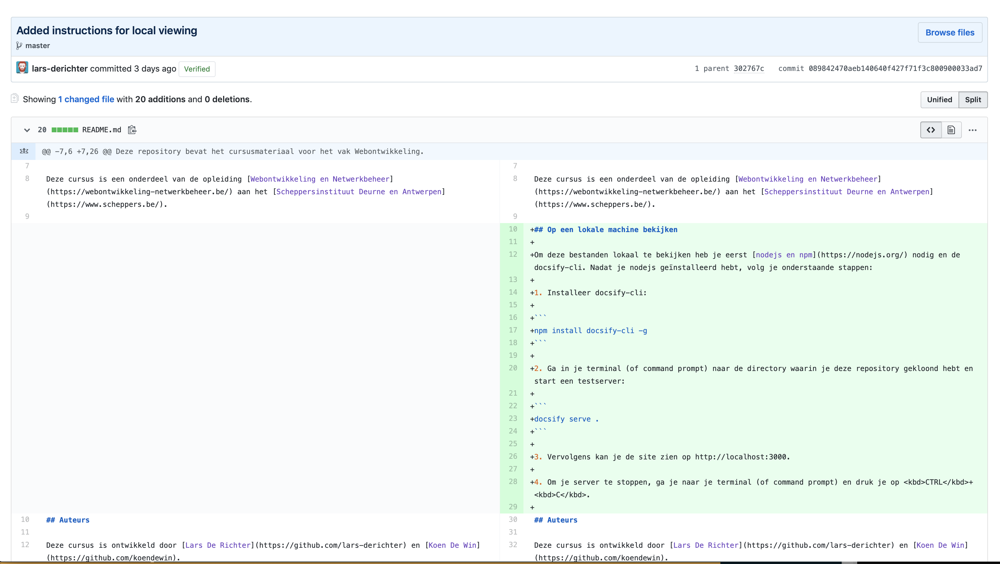
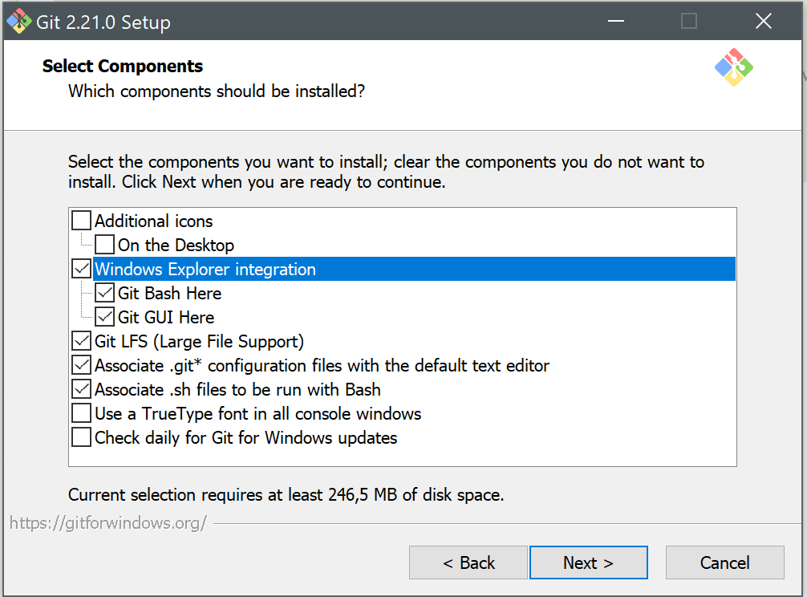

# Version Control

---

# Waarom?

&&&

<!-- .slide: data-background-image="_images/facepalm.gif" data-background-size="contain" -->

## Minder

&&&

<!-- .slide: data-background-image="_images/euphoria.gif" data-background-size="contain" -->

## Meer

&&&

## Nooit meer

&&&

## Wel

&&&

## Ook

&&&

## Dus

- Geschiedenis van alle bestanden <!-- .element: class="fragment" -->
- Rollback/Undo <!-- .element: class="fragment" -->
- Waarom van aanpassingen <!-- .element: class="fragment" -->
- Blame game <!-- .element: class="fragment" -->
- Gelijktijdig werken aan een project <!-- .element: class="fragment" -->

---

# Git

&&&

## Wat?

- distributed <!-- .element: class="fragment" -->
- version <!-- .element: class="fragment" -->
- control <!-- .element: class="fragment" -->

Notes:

- Distributed: used in opposition to Centralized. This means that there is no single "correct" computer for the source code to exist upon. Each person who uses or writes the code will have their own copy of the code and its history.
- Version: This refers to the idea that source code files change over time. When you save a file, that is a single version of the file. When you add a new line of code and save it again, that is a new version of the file.
- Control: The Git system is used to control or manage the process of creating new Versions of source code files, and the process of distributing those versions to other people.

Bron: Ada Developers Academy. (2018, August 13). Intro to Git. Retrieved May 20, 2019, from https://github.com/Ada-Developers-Academy/textbook-curriculum/blob/master/00-programming-fundamentals/git-intro-to-git.md#version-control

&&&

## Linus Torvalds

<!-- .slide: data-background-image="_images/linus-torvalds.jpg" data-background-size="contain" data-background-opacity="0.7"  -->

Ja die van Linux <!-- .element: class="fragment" -->

Notes:

- In 2005 verzuurt de relatie tussen Bitkeeper en de Linux Kernel developers en Linus Torvalds bouwt een eigen open source systeem: git.
- Momenteel is dit wereldwijd het meest gebruikte version control system.

---

<!-- .slide: data-background-image="_images/octocat.png" data-background-size="contain" data-background-opacity="0.5" -->

# Github

&&&

## Wat?

- centrale hosting server voor git repositories <!-- .element: class="fragment" -->
- handige website om je code en geschiedenis te bekijken <!-- .element: class="fragment" -->
- gratis voor open source <!-- .element: class="fragment" -->
- studenten krijgen gratis Pro account <!-- .element: class="fragment" -->
- broncode van de meeste open source projecten <!-- .element: class="fragment" -->
- (eigendom van Microsoft sinds 2018) <!-- .element: class="fragment" -->

&&&

## Maak een Github account aan

Gebruik je e-mailadres van school

https://github.com/

&&&

## GitHub Student Developer Pack

Vraag het ‘GitHub Student Developer Pack’ aan:

https://education.github.com/pack

&&&

Mail je github gebruikersnaam naar mij

&&&

## Word lid van van 7-WN

Je zal één (of meerdere) e-mail(s) krijgen met een activatielink. Activeer die!

---

# Git installeren

&&&

https://git-scm.com/downloads

&&&

## Windows gebruikers

&&&

Selecteer `Windows Explorer integration`

&&&

Selecteer `Use Visual Studio Code as Git’s default editor`

&&&

Laat verder de defaults staan

---

# GUI vs. CLI

&&&

Gebruik command line!

&&&

Tot je begrijpt wat je doet…

&&&

## GUI

- Verbergt complexiteit
- Verbergt details
- Beperkt mogelijkheden
- Bemoeilijkt troubleshooting
- **Je begrijpt niet wat je aan het doen bent**

&&&

## CLI

- Leercurve, juiste commando's leren gaat niet vanzelf
- Geen beperkingen op mogelijkheden
- Instructies zijn éénduidig en compact
- Makkelijker reproduceerbaar

---

# Git in 3 minuten

of 5 of 10…

&&&
